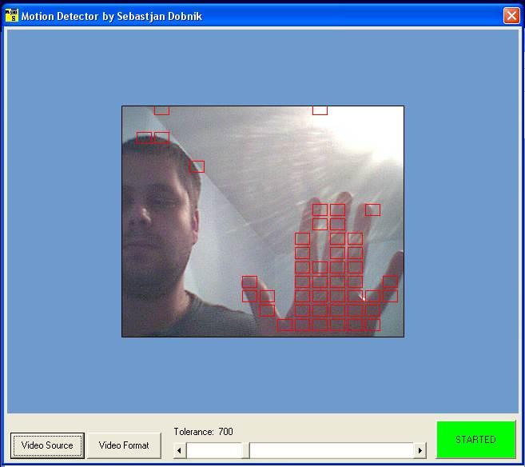



## Motion Detection

### Description

Video Motion Detection is really quite simple. The 'joke' is to compare

previous picture with the new one. So, teoreticaly this differences

between 2 pictures are motion of some kind...

BUT it is not that easy If U wish to do it correctly you'll have to

1. break pixel colors apart

2. set up a small buffer for let us say last 20 frames to counteraffect

picture / pixel blinking

3. unite colors

4. check average value of a single pixel for the last xx frames

5. Check if difference is big enought to raise detection

and finaly

6. Detect motion...

This small demonstration requires Controll ezVidC60.ocx which is added to

driver.zip file. You can also download it from http://www.shrinkwrapvb.com.

This demo runs (or so it should) on win 98 or better... up to XP and is written for

VB5 and above.

Hope u like this demo. Votes and sugestions are wanted.
 
### More Info
 

             |
---                |---
**Submitted On**   |2003-08-04 20:54:02
**By**             |[Dobnik Sebastjan](https://github.com/Planet-Source-Code/PSCIndex/blob/master/ByAuthor/dobnik-sebastjan.md)
**Level**          |Intermediate
**User Rating**    |5.0 (50 globes from 10 users)
**Compatibility**  |VB 5\.0, VB 6\.0
**Category**       |[Graphics](https://github.com/Planet-Source-Code/PSCIndex/blob/master/ByCategory/graphics__1-46.md)
**World**          |[Visual Basic](https://github.com/Planet-Source-Code/PSCIndex/blob/master/ByWorld/visual-basic.md)
**Archive File**   |[Motion\_Det162420842003\.zip](https://github.com/Planet-Source-Code/dobnik-sebastjan-motion-detection__1-47404/archive/master.zip)

